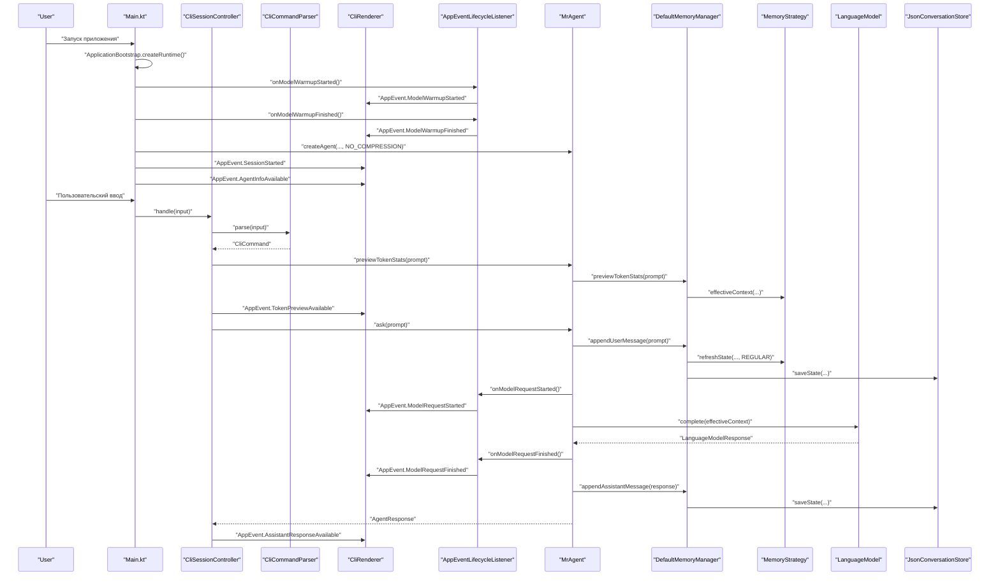
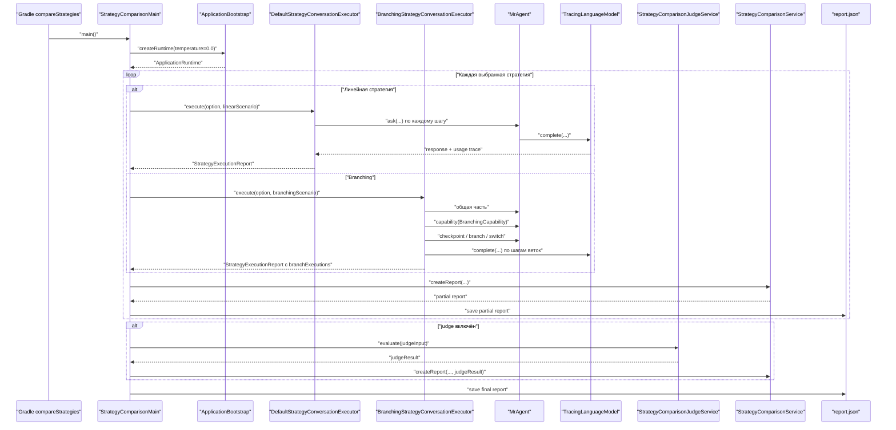
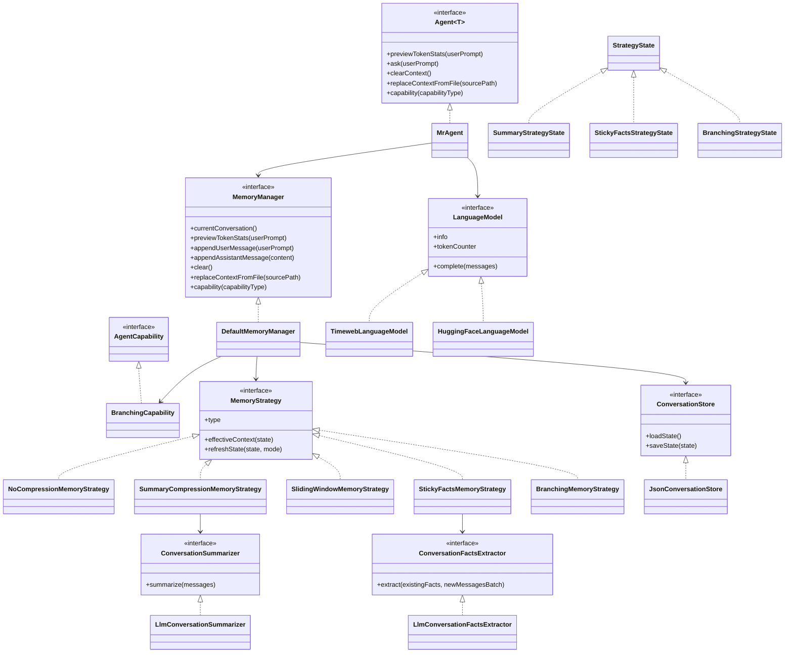

# ai_advent_day_11

CLI-агент для диалога с LLM по HTTP API с сохранением истории, набором стратегий памяти и отдельным dev-режимом для сравнения этих стратегий на одном сценарии.

## Что умеет проект

- запускать интерактивный чат в консоли;
- переключать модель между `timeweb` и `huggingface`;
- хранить историю диалога по моделям в JSON;
- использовать 5 стратегий памяти:
  - без сжатия;
  - rolling summary;
  - скользящее окно;
  - sticky facts;
  - ветки диалога;
- показывать локальную оценку токенов перед запросом;
- запускать отдельный comparison runner и сравнивать стратегии по:
  - токенам;
  - финальным ответам;
  - judge-оценке качества, стабильности и удобства.

## Быстрый старт

1. Скопируйте `config/app.properties.example` в `config/app.properties`.
2. Заполните токены для нужного провайдера.
3. Соберите и запустите проект:

```powershell
.\gradlew.bat build
.\gradlew.bat installDist
.\build\install\ai_advent_day_11\bin\ai_advent_day_11.bat
```

Если нужен запуск в новом окне PowerShell:

```powershell
Start-Process powershell -ArgumentList '-NoExit','-Command','Set-Location ''C:\Users\compadre\Downloads\Projects\AiAdvent\day_11''; .\build\install\ai_advent_day_11\bin\ai_advent_day_11.bat'
```

## Конфигурация

### Timeweb

- `AGENT_ID`
- `TIMEWEB_USER_TOKEN`

### Hugging Face

- `HF_API_TOKEN`

Если настроено несколько провайдеров сразу, по умолчанию выбирается первая доступная модель из `LanguageModelFactory`.

## Команды в чате

### Общие команды

- `clear` — очищает контекст, сохраняя системное сообщение.
- `models` — показывает доступные модели и их статус.
- `memory` — показывает все слои памяти.
- `memory short` — показывает short-term память.
- `memory working` — показывает working memory текущей задачи.
- `memory long` — показывает long-term memory.
- `use <id>` — переключает модель. При переключении заново выбирается стратегия памяти.
- `exit` / `quit` — завершает приложение.

### Дополнительные команды стратегии `Ветки диалога`

Эти команды доступны только при активной стратегии `Ветки диалога`:

- `checkpoint [name]` — создаёт checkpoint текущего состояния диалога.
- `branches` — показывает активную ветку, последний checkpoint и список веток.
- `branch create <name>` — создаёт новую ветку от последнего checkpoint.
- `branch use <name>` — переключает диалог на выбранную ветку.

## Стратегии памяти

В проекте используется layered memory model:

- `short-term` — текущий диалог и выбранная strategy short-term памяти;
- `working` — данные текущей задачи;
- `long-term` — профиль, устойчивые решения и повторно полезные знания.

По умолчанию приложение стартует со стратегией `Без сжатия`.

При переключении модели через `use <id>` CLI предлагает выбрать одну из доступных стратегий памяти.

### 1. Без сжатия

Агент отправляет в модель всю сохранённую историю как есть.

### 2. Сжатие через summary

Когда в диалоге накапливается минимум 5 сообщений, стратегия начинает сворачивать старую часть истории в rolling summary:

- summary обновляется пачками по 3 сообщения;
- последние 2 сообщения остаются вне summary;
- в prompt уходят summary и свежий хвост сообщений.

### 3. Скользящее окно

В prompt уходят:

- системные сообщения;
- только последние 2 сообщения диалога.

Остальная история сохраняется, но не отправляется в модель.

### 4. Sticky Facts

Стратегия хранит отдельный блок `facts` и отправляет в модель:

- facts;
- последние 2 сообщения.

Сейчас facts обновляются батчами:

- после накопления 3 новых пользовательских сообщений;
- через отдельный LLM-вызов;
- в facts попадают цель, ограничения, предпочтения, решения и договорённости.

### 5. Ветки диалога

Стратегия позволяет:

- сохранить checkpoint общего состояния диалога;
- создать несколько независимых веток от одной точки;
- продолжить диалог в каждой ветке отдельно;
- переключаться между ветками без смешивания контекста.

Создание стратегий централизовано в `MemoryStrategyFactory`.

## Как собирается prompt

Итоговый prompt собирается в таком порядке:

1. system prompt
2. long-term memory
3. working memory
4. short-term context из выбранной стратегии

## Архитектура

Проект сейчас устроен по принципу:

- общее ядро отдельно;
- всё strategy-specific рядом с конкретной стратегией;
- CLI выступает как адаптер поверх headless core;
- comparison runner живёт отдельно от основного пользовательского потока.

### Основные слои

- `bootstrap` — сборка runtime-контекста приложения без привязки к конкретному UI.
- `app.output` — нейтральные события приложения, которые может потреблять любой UI.
- `ui.cli` — парсинг команд, состояние CLI-сессии и рендеринг в консоль.
- `agent` — core-логика агента, lifecycle и capability.
- `agent.memory.core` — общие контракты памяти и менеджер памяти.
- `agent.memory.model` — модели состояния памяти.
- `agent.memory.strategy` — фабрика стратегий и их feature-specific подпапки.
- `devtools.comparison` — сценарии сравнения стратегий, judge и отчёты.

### Структура memory-слоя

- `agent/memory/core`
  - `DefaultMemoryManager`
  - `MemoryManager`
  - `MemoryStrategy`
- `agent/memory/layer`
  - `MemoryLayerAllocator`
  - `RuleBasedMemoryLayerAllocator`
- `agent/memory/model`
  - `MemoryState`
  - `ShortTermMemory`
  - `WorkingMemory`
  - `LongTermMemory`
  - `StrategyState`
- `agent/memory/prompt`
  - `LayeredMemoryPromptAssembler`
- `agent/memory/strategy`
  - `MemoryStrategyFactory`
  - `MemoryStrategyType`
  - `branching/*`
  - `nocompression/*`
  - `slidingwindow/*`
  - `stickyfacts/*`
  - `summary/*`

### Capability-подход

Базовые интерфейсы `Agent` и `MemoryManager` содержат только общее API.

Дополнительные возможности конкретной стратегии отдаются через capability-слой. Сейчас это используется для `Branching`: специализированные операции доступны только если активная стратегия их поддерживает.

## Основной пользовательский сценарий

Ниже показано, как пользовательский запрос проходит через основные части приложения.



## Режим сравнения стратегий

Для сравнения стратегий есть отдельный dev-инструмент:

```powershell
.\gradlew.bat compareStrategies
```

По умолчанию он:

- запускается на 5 шагах;
- включает LLM judge;
- сравнивает все доступные стратегии;
- для `branching` тоже уважает `comparisonSteps`, а не использует фиксированные 8 шагов.

### Полезные варианты запуска

Короткий прогон по умолчанию:

```powershell
.\gradlew.bat compareStrategies
```

Полный прогон на 12 шагах:

```powershell
.\gradlew.bat compareStrategies -PcomparisonSteps=12
```

Запуск только для выбранных стратегий:

```powershell
.\gradlew.bat compareStrategies -PcomparisonStrategies=no_compression,sticky_facts,branching
```

Запуск без judge:

```powershell
.\gradlew.bat compareStrategies -PcomparisonJudge=false
```

Запуск в новом окне PowerShell:

```powershell
Start-Process powershell -ArgumentList '-NoExit','-Command','chcp.com 65001 | Out-Null; [Console]::InputEncoding = [System.Text.Encoding]::UTF8; [Console]::OutputEncoding = [System.Text.Encoding]::UTF8; $OutputEncoding = [System.Text.Encoding]::UTF8; Set-Location ''C:\Users\compadre\Downloads\Projects\AiAdvent\day_11''; .\gradlew.bat compareStrategies'
```

### Что делает comparison runner

- для линейных стратегий (`no_compression`, `summary_compression`, `sliding_window`, `sticky_facts`) прогоняет один сценарий сбора ТЗ;
- для `branching` запускает отдельный branch-aware сценарий:
  - общая часть;
  - checkpoint;
  - две ветки с независимым продолжением;
- собирает единый JSON-отчёт;
- при включённом judge делает дополнительный LLM-запрос для качественной оценки.

Итоговый отчёт сохраняется в `build/reports/strategy-comparison/report.json`.

### Схема работы comparison mode



## Как читать comparison report

В консоль и в JSON-отчёт попадают, в частности, такие поля:

- `Локальные prompt-токены` — локальная оценка размера основного prompt.
- `Provider prompt-токены` — prompt-токены по данным провайдера.
- `Provider completion-токены` — токены, сгенерированные моделью.
- `Provider total-токены` — сумма prompt и completion по данным провайдера.
- `Внутренние LLM-вызовы по шагам` — сколько дополнительных обращений к модели стратегия делала внутри каждого шага.

Для стратегий с внутренними служебными вызовами, например `summary_compression` и `sticky_facts`, provider prompt-токены могут быть заметно больше локальных.

## Диаграмма классов



## Как читать проект

Если хочется быстро понять поток управления, удобный порядок такой:

1. `src/main/kotlin/Main.kt`
2. `src/main/kotlin/bootstrap/ApplicationBootstrap.kt`
3. `src/main/kotlin/ui/cli/CliCommands.kt`
4. `src/main/kotlin/ui/cli/CliCommandParser.kt`
5. `src/main/kotlin/ui/cli/CliSessionController.kt`
6. `src/main/kotlin/ui/cli/CliRenderer.kt`
7. `src/main/kotlin/agent/impl/MrAgent.kt`
8. `src/main/kotlin/agent/core/Agent.kt`
9. `src/main/kotlin/agent/memory/core/DefaultMemoryManager.kt`
10. `src/main/kotlin/agent/memory/strategy/MemoryStrategyFactory.kt`
11. `src/main/kotlin/agent/memory/model/MemoryState.kt`
12. `src/main/kotlin/agent/memory/model/StrategyState.kt`
13. `src/main/kotlin/agent/memory/strategy/summary/SummaryCompressionMemoryStrategy.kt`
14. `src/main/kotlin/agent/memory/strategy/stickyfacts/StickyFactsMemoryStrategy.kt`
15. `src/main/kotlin/agent/memory/strategy/branching/BranchingMemoryStrategy.kt`
16. `src/main/kotlin/agent/memory/strategy/branching/BranchCoordinator.kt`
17. `src/main/kotlin/devtools/comparison/StrategyComparisonMain.kt`
18. `src/main/kotlin/devtools/comparison/BranchingStrategyConversationExecutor.kt`
19. `src/main/kotlin/agent/storage/JsonConversationStore.kt`

## Тесты

Запуск тестов:

```powershell
.\gradlew.bat test
```

Покрываются, в частности:

- фабрика моделей и bootstrap;
- storage и mapper'ы;
- все стратегии памяти;
- branching-сценарии и capability-поведение;
- comparison runner;
- judge-интеграция;
- форматирование token stats.

## IDE

Для навигации по коду и запуска тестов удобнее всего открыть проект в IntelliJ IDEA Community Edition.

